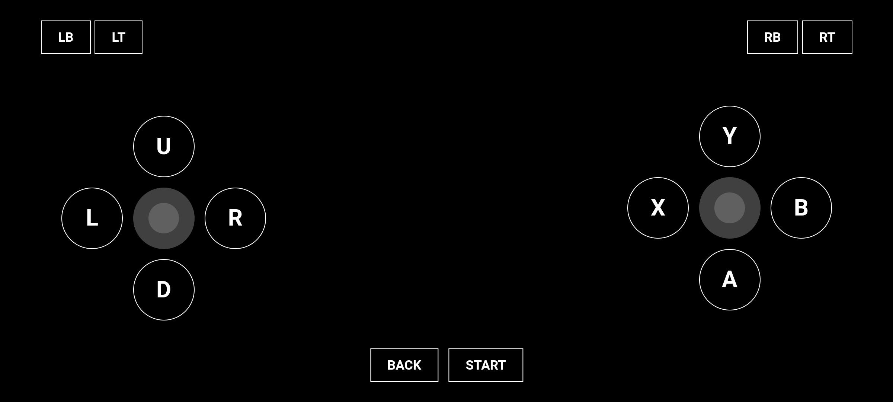

# VPAD 🎮

Linux Virtual Gamepad powered by Python + WebSocket + uinput.



## How To Use

Clone this repository:

``` bash
$ git clone https://github.com/mcanam/vpad
$ cd vpad
```

Create a virtual environment:

``` bash
$ python -m venv .venv
$ source .venv/bin/activate
```

Install dependencies:

``` bash
pip install -r requirements.txt
```

Run the web server (with sudo, required for uinput access):

``` bash
$ sudo .venv/bin/python -m uvicorn main:app --reload --host 0.0.0.0 --port 8000
```

Open the controller UI on your mobile device or any browser in the same local network:

```
http://<your-local-ip>:8000
```
